  <picture>
    <source media="(prefers-color-scheme: dark)" srcset="assets/banner-dark.svg">
    
  </picture>

  <a href="https://stefandango.dev">stefandango.dev</a> ·
  <a href="https://www.linkedin.com/in/stefandango/">LinkedIn</a> ·
  <a href="https://github.com/stefandango/agentic-rag">agentic-rag</a>

---

### About

11+ years building backend systems — architecture, integrations and security — much of it in regulated environments.

Alongside work I build self-hosted AI infrastructure in C#: retrieval-augmented systems on Microsoft.Extensions.AI, with local inference and a self-hosted vector store. [agentic-rag](https://github.com/stefandango/agentic-rag) is the public part: one source-agnostic search contract, and an inference tier that switches between an EU-hosted model and a local one through configuration rather than code. The same stack runs scheduled agents over my own notes, which live in private repositories.
